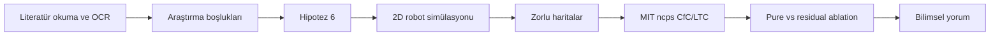
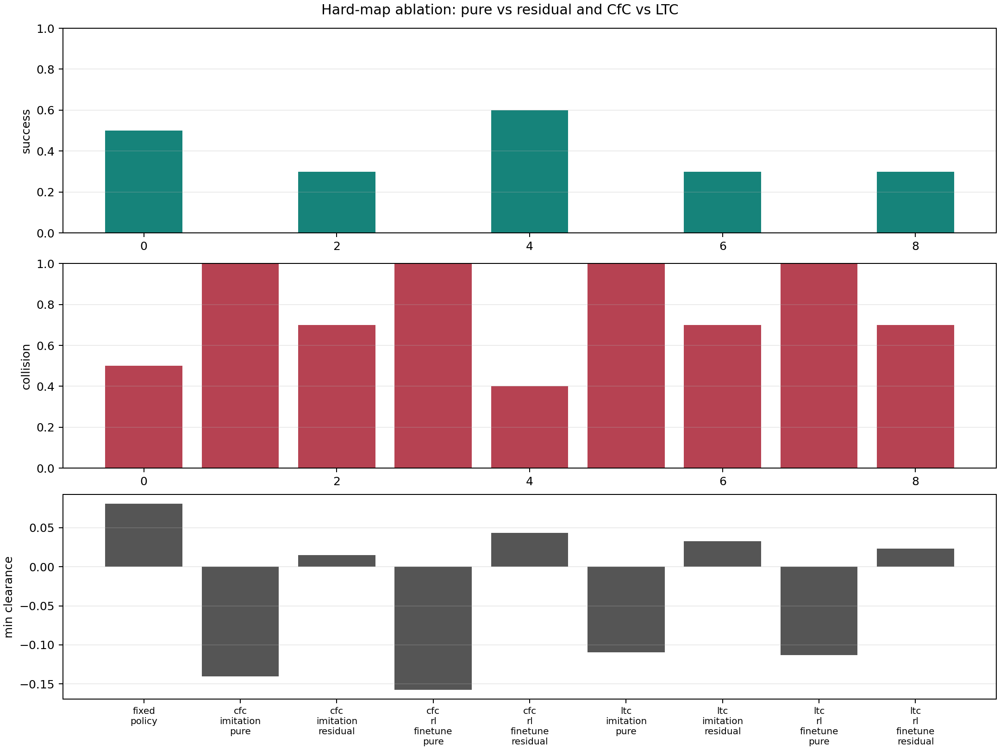
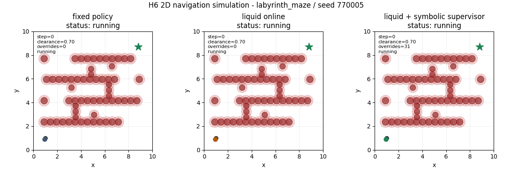

# Hipotez 6: Liquid Neural Network ile Güvenli Mobil Robot Navigasyonu

Bu repo, yüksek lisans dersi için hazırlanmış bir araştırma prototipidir. Amaç, mobil robot navigasyonu literatüründen seçilen bir araştırma boşluğunu ve **Hipotez 6**'yı Python tabanlı 2D simülasyonlarla incelemektir.

Ayrıntılı teknik README ve çalıştırma talimatları:

➡️ [`hypothesis_6_lnn_neurosymbolic/README.md`](hypothesis_6_lnn_neurosymbolic/README.md)

## Projenin Tek Cümlelik Özeti

Liquid Neural Network / Neural Circuit Policy tabanlı öğrenen bir navigasyon kontrolcüsünün, zorlu ve değişen engel konfigürasyonlarında tek başına mı yoksa güvenli bir sabit politika üzerine residual düzeltici olarak mı daha iyi çalıştığı test edildi.

## Literatür Temeli

Çalışma iki 2024 derleme makalesinden yola çıkar:

1. S. Al Mahmud, A. Kamarulariffin, A. M. Ibrahim, and A. J. H. Mohideen, "Advancements and Challenges in Mobile Robot Navigation: A Comprehensive Review of Algorithms and Potential for Self-Learning Approaches," *Journal of Intelligent & Robotic Systems*, 2024. DOI: [10.1007/s10846-024-02149-5](https://doi.org/10.1007/s10846-024-02149-5). Doğrudan PDF: [Springer PDF](https://link.springer.com/content/pdf/10.1007/s10846-024-02149-5.pdf?utm_source=clarivate&getft_integrator=clarivate)
2. K. Katona, H. A. Neamah, and P. Korondi, "Obstacle Avoidance and Path Planning Methods for Autonomous Navigation of Mobile Robot," *Sensors*, 2024. DOI: [10.3390/s24113573](https://doi.org/10.3390/s24113573). Makale sayfası: [MDPI Sensors](https://www.mdpi.com/1424-8220/24/11/3573)

Bu makalelerden çıkarılan seçili araştırma boşluğu:

> **Nöro-sembolik öz-öğrenmede temsil uyumsuzluğu ve Liquid Neural Network potansiyeli**

## Hipotez 6

> LNN tabanlı sürekli öğrenen bir navigasyon politikası, sabit ağırlıklı DRL politikasına göre dağıtım sonrası ortam değişikliklerine daha hızlı adaptasyon gösterebilir; ancak vanishing gradient ve parametre hassasiyeti nedeniyle kararlılık riski taşır ve bu risk güvenlik süpervizörüyle sınırlandırılmalıdır.

## Ne Yapıldı?



Projede:

- 2D mobil robot navigasyon simülasyonu kuruldu.
- Zigzag, dense maze, deceptive U-trap, sensor shadow ve labyrinth gibi zorlu haritalar eklendi.
- Harita çizmek, start-goal değiştirmek, engel eklemek ve parametre ayarlamak için web arayüzü geliştirildi.
- MIT'nin resmi `ncps` kütüphanesi ile `CfC` ve `LTC` Neural Circuit Policy modelleri entegre edildi.
- Saf NCP, residual NCP, CfC-LTC ve imitation/RL fine-tune karşılaştırmaları yapıldı.
- Sonuçlar CSV, Markdown, LaTeX/PDF, PNG ve GIF olarak kaydedildi.

## Ana Bulgular

Özet tablo:

| Denetleyici | Varyant | Default başarı | Default çarpışma | Zorlu harita başarı | Zorlu harita çarpışma |
| --- | --- | ---: | ---: | ---: | ---: |
| Sabit politika | Baseline | 0.750 | 0.000 | 0.500 | 0.500 |
| CfC NCP | Pure + RL | 0.000 | 1.000 | 0.000 | 1.000 |
| LTC NCP | Pure + RL | 0.000 | 1.000 | 0.000 | 1.000 |
| CfC NCP | Residual + RL | 1.000 | 0.000 | 0.600 | 0.400 |
| LTC NCP | Residual + RL | 0.875 | 0.000 | 0.300 | 0.700 |

Kısa yorum:

- Saf NCP modelleri bu küçük deney düzeninde güvenli navigasyon öğrenemedi.
- Residual yaklaşım, saf NCP'ye göre çok daha kararlı oldu.
- `CfC + residual + RL fine-tune`, zorlu haritalarda sabit politikadan daha iyi sonuç verdi.
- Bulgular, öğrenen liquid kontrolcünün tek başına değil, güvenli bir süpervizör veya baseline ile birlikte kullanılmasının daha savunulabilir olduğunu gösteriyor.

## Örnek Çıktılar





## Çalıştırma

Kurulum:

```powershell
C:\ProgramData\miniconda3\python.exe -m pip install -r hypothesis_6_lnn_neurosymbolic\requirements.txt
```

Web arayüzü:

```powershell
cd hypothesis_6_lnn_neurosymbolic
C:\ProgramData\miniconda3\python.exe src\custom_map_server.py --port 8765
```

Tarayıcı:

```text
http://127.0.0.1:8765
```

Ablation deneyi:

```powershell
cd hypothesis_6_lnn_neurosymbolic
C:\ProgramData\miniconda3\python.exe src\train_ncp_ablation.py --train-sequences 48 --val-sequences 12 --seq-len 24 --imitation-epochs 5 --rl-episodes 6 --eval-episodes 2 --hidden-dim 24
```

## Önemli Dosyalar

- [`hypothesis_6_lnn_neurosymbolic/src/run_lnn_experiment.py`](hypothesis_6_lnn_neurosymbolic/src/run_lnn_experiment.py): Ana simülasyon
- [`hypothesis_6_lnn_neurosymbolic/src/train_ncp_ablation.py`](hypothesis_6_lnn_neurosymbolic/src/train_ncp_ablation.py): NCP imitation/RL ablation
- [`hypothesis_6_lnn_neurosymbolic/src/custom_map_server.py`](hypothesis_6_lnn_neurosymbolic/src/custom_map_server.py): Web arayüzü sunucusu
- [`hypothesis_6_lnn_neurosymbolic/results/ncp_ablation_summary.md`](hypothesis_6_lnn_neurosymbolic/results/ncp_ablation_summary.md): Deney özeti
- [`hypothesis_6_lnn_neurosymbolic/results/h6_ncp_project_report.pdf`](hypothesis_6_lnn_neurosymbolic/results/h6_ncp_project_report.pdf): Bilimsel rapor

## Sunum İçin Kısa Anlatım

Bu proje, literatürdeki "öğrenen robot navigasyon politikaları adaptif olabilir ama güvenlik garantileri zayıf" problemini ele alır. Hipotez 6, Liquid Neural Network tabanlı sürekli öğrenen politikaların adaptasyon potansiyelini önerir; fakat kararlılık riskinin güvenlik süpervizörüyle sınırlandırılması gerektiğini söyler. Simülasyon sonuçları da bu yönde çıktı: saf NCP başarısız oldu, residual NCP ise daha güvenli ve daha başarılı davrandı.
