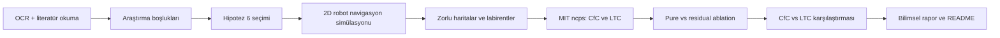

# Hipotez 6: Liquid Neural Network ile Güvenli Mobil Robot Navigasyonu

Bu proje, yüksek lisans dersi kapsamında seçilen mobil robot navigasyonu literatüründen çıkarılan bir araştırma hipotezini küçük, tekrarlanabilir ve görselleştirilebilir bir simülasyon ortamında incelemek için hazırlandı.

Çalışmanın merkezindeki soru şudur: **Liquid Neural Network / Neural Circuit Policy tabanlı sürekli öğrenen bir kontrolcü, değişen engel konfigürasyonlarında sabit bir navigasyon politikasına göre daha iyi adaptasyon sağlayabilir mi; yoksa güvenlik için mutlaka sembolik veya kural tabanlı bir denetleyiciye mi ihtiyaç duyar?**

> Not: Bu repoda "açık" kelimesi güvenlik açığı anlamında değil, literatürdeki **araştırma boşluğu** anlamında kullanılmıştır.

## Kısa Özet

- Literatür taramasında iki 2024 derleme makalesi incelendi.
- Bu makalelerden mobil robot navigasyonunda öğrenen sistemler, nöro-sembolik güvenlik ve Liquid Neural Network potansiyeliyle ilgili araştırma boşlukları çıkarıldı.
- Seçilen araştırma boşluğu: **Nöro-sembolik öz-öğrenmede temsil uyumsuzluğu ve Liquid Neural Network potansiyeli**.
- Seçilen hipotez: **Hipotez 6**.
- Python ile 2D mobil robot navigasyon simülasyonu geliştirildi.
- Zorlu haritalar, labirentler, GIF/PNG çıktıları ve etkileşimli harita çizim arayüzü eklendi.
- MIT'nin resmi `ncps` kütüphanesi kullanılarak `CfC` ve `LTC` tabanlı Neural Circuit Policy modelleri denendi.
- Saf NCP, residual NCP, CfC-LTC karşılaştırması ve kısa imitation/RL ablation deneyleri yapıldı.

Ana bulgu (10 bağımsız seed, Wilson 95% CI, Mann-Whitney U + Benjamini-Hochberg FDR):

- **Saf NCP/MLP politikaları bu eğitim bütçesinde başarısız kaldı** (başarı ≈ 0, çarpışma 0.85–1.00). Residual yapı ise çarpışmayı büyük ölçüde düşürdü (d ≈ 1.0–5.8).
- **Residual NCP, sabit baseline'a göre zorlu haritalarda ölçülebilir avantaj sağlamadı** (p ≥ 0.66, Δ ≤ ±0.03). Sadece eğitim dağılımına yakın default haritalarda zayıf sinyal var (cfc/mlp imitation residual p ≈ 0.013–0.048, d ≈ 0.2), bu da hard haritada kayboluyor.
- **Eğitilmiş residual ≈ rastgele ağırlıklı residual** (p ≥ 0.77). Yani residual yapının değeri öğrenilmiş NCP ağırlığından değil, altındaki fixed baseline'dan geliyor.
- **CfC ≈ LTC ≈ MLP** (p ≥ 0.08). Sürekli zamanlı NCP mimarisinin bu görev setinde feedforward MLP'ye karşı istatistiksel üstünlüğü gözlenmedi.

Bu sonuç, H6'nın **güvenlik süpervizörü gerekir** kısmını (saf NCP başarısız, residual sabit baseline + güvenli) güçlü destekler; **LNN adaptasyon sağlar** kısmını ise bu bütçe ve görev setinde desteklemez.

## Seçilen Makaleler

Çalışmanın literatür temeli şu iki derleme makalesine dayanır:

1. S. Al Mahmud, A. Kamarulariffin, A. M. Ibrahim, and A. J. H. Mohideen, "Advancements and Challenges in Mobile Robot Navigation: A Comprehensive Review of Algorithms and Potential for Self-Learning Approaches," *Journal of Intelligent & Robotic Systems*, vol. 110, article 120, 2024. DOI: [10.1007/s10846-024-02149-5](https://doi.org/10.1007/s10846-024-02149-5). Doğrudan PDF: [Springer PDF](https://link.springer.com/content/pdf/10.1007/s10846-024-02149-5.pdf?utm_source=clarivate&getft_integrator=clarivate)
2. K. Katona, H. A. Neamah, and P. Korondi, "Obstacle Avoidance and Path Planning Methods for Autonomous Navigation of Mobile Robot," *Sensors*, vol. 24, article 3573, 2024. DOI: [10.3390/s24113573](https://doi.org/10.3390/s24113573). Makale sayfası: [MDPI Sensors](https://www.mdpi.com/1424-8220/24/11/3573)

İlk makale öz-öğrenme, derin pekiştirmeli öğrenme, nöro-sembolik yaklaşımlar ve Liquid Neural Network potansiyeline odaklanır. İkinci makale ise klasik, sezgisel, hibrit ve öğrenme tabanlı engel kaçınma/yol planlama yöntemlerini sınıflandırır. Bu iki makale birlikte okunduğunda, öğrenen robot politikalarının adaptasyon potansiyeli ile güvenlik/kararlılık garantisi eksikliği arasında önemli bir gerilim olduğu görülür.

## Seçilen Araştırma Boşluğu

Seçilen boşluk şudur:

> **Nöro-sembolik öz-öğrenmede temsil uyumsuzluğu ve Liquid Neural Network potansiyeli**

Bu boşlukta temel problem, öğrenen sinir ağı politikasının dinamik ortamlara uyum sağlayabilmesi fakat sembolik güvenlik kuralları, açıklanabilirlik ve kararlı kontrol ile nasıl birleştirileceğinin net olmamasıdır. Liquid Neural Network ve Neural Circuit Policy mimarileri zamana bağlı, kompakt ve sürekli dinamiklere sahip oldukları için bu alanda ilginç bir adaydır. Ancak vanishing gradient, parametre hassasiyeti ve dağılım dışı ortamda kararsız davranış riski devam eder.

## Hipotez 6

> **H6:** LNN tabanlı sürekli öğrenen bir navigasyon politikası, sabit ağırlıklı DRL politikasına göre dağıtım sonrası ortam değişikliklerine, örneğin yeni engel konfigürasyonlarına ve değişen algı koşullarına, daha hızlı adaptasyon gösterir; ancak vanishing gradient ve parametre hassasiyeti nedeniyle kararlılık riski taşır ve bu risk güvenlik süpervizörüyle sınırlandırılmalıdır.

Bu proje H6'yı tam ölçekli bir robotik sistem olarak kanıtlamaz. Ama hipotezi sınamak için küçük ölçekli bir deney zemini kurar: farklı haritalar, sabit politika, saf NCP, residual NCP, CfC-LTC karşılaştırması ve görsel simülasyon çıktıları.

## Kısaltmalar ve Temel Kavramlar

| Terim | Açılım | Açıklama |
| --- | --- | --- |
| LNN | Liquid Neural Network | Girdiye ve zamana bağlı dinamikleri olan sinir ağı ailesidir. Bu çalışmada LNN fikri, değişen haritalara uyum sağlayabilecek öğrenen kontrolcü adayı olarak ele alındı. |
| NCP | Neural Circuit Policy | MIT'nin `ncps` kütüphanesinde yer alan, biyolojik sinir devrelerinden esinlenen seyrek bağlantılı politika mimarisidir. Robotun hangi yöne hareket edeceğine karar veren öğrenen kontrolcü olarak kullanıldı. |
| CfC | Closed-form Continuous-time | Sürekli zamanlı nöral dinamikleri kapalı form yaklaşımla hesaplayan NCP katmanıdır. Bu çalışmada LTC'ye göre daha kararlı sonuç verdi. |
| LTC | Liquid Time-Constant | Öğrenilebilir zaman sabitleri kullanan liquid neural network katmanıdır. Dinamik sistem gibi davranması beklenir, fakat parametre hassasiyeti daha belirgin olabilir. |
| RL | Reinforcement Learning | Pekiştirmeli öğrenmedir. Robot doğru ilerleme ve hedefe ulaşma için ödül, çarpışma ve riskli davranış için ceza alır. |
| DRL | Deep Reinforcement Learning | Pekiştirmeli öğrenmenin derin sinir ağlarıyla yapılan halidir. Hipotezde sabit ağırlıklı DRL politikası, dağıtım sonrası adaptasyonu sınırlı bir referans fikir olarak kullanıldı. |
| Imitation learning | Gösterimden öğrenme | Modelin önce uzman/planner davranışını taklit ederek başlangıç politikası öğrenmesidir. Bu, RL öncesi daha kontrollü bir başlangıç sağlar. |
| Fine-tune | İnce ayar | Önceden eğitilmiş politikanın kısa ek eğitimle belirli göreve uyarlanmasıdır. Bu projede imitation sonrası kısa RL fine-tune kullanıldı. |
| Baseline | Referans politika | Karşılaştırma için kullanılan sabit, geometrik ve elle yazılmış navigasyon politikasıdır. |
| Pure NCP | Saf NCP | Robotun kararını tamamen NCP çıktısına bırakan deney varyantıdır. Güvenlik açısından en riskli ama model kapasitesini en doğrudan gösteren testtir. |
| Residual NCP | Artık/düzeltici NCP | Sabit politikanın karar skorlarına NCP'nin küçük bir düzeltme sinyali eklediği varyanttır. Gerçek robotik için daha güvenli ve daha savunulabilir bir kurulumdur. |
| Safety supervisor | Güvenlik süpervizörü | Öğrenen politikanın riskli aksiyonlarını sınırlayan güvenlik katmanıdır. Bu prototipte kısa ufuklu çarpışma ve açıklık kontrolleriyle temsil edildi. |
| OOD | Out-of-distribution | Eğitimde görülmeyen veya alışılmıştan farklı harita/engel koşullarıdır. Zorlu haritalar bu fikri basitçe test etmek için kullanıldı. |
| Sim-to-real | Simülasyondan gerçeğe geçiş | Simülasyonda çalışan yöntemin gerçek robota aktarılması problemidir. Bu proje henüz simülasyon düzeyindedir. |

## Ablation Nedir?

Ablation, bir modelin veya sistemin hangi parçasının sonuca ne kadar katkı verdiğini anlamak için yapılan kontrollü çıkarma/değiştirme deneyidir. Yani sistem tek bir bütün olarak değil, farklı bileşenleri değiştirilerek incelenir.

Bu projede ablation üç soruya cevap vermek için kullanıldı:

- **Pure vs residual:** NCP tek başına mı daha iyi çalışıyor, yoksa sabit güvenli politika üzerine düzeltici olarak mı daha kararlı?
- **CfC vs LTC:** MIT `ncps` içindeki iki liquid/NCP katmanı aynı görevde farklı davranıyor mu?
- **Imitation vs RL fine-tune:** Uzman davranışını taklit etmek yeterli mi, yoksa kısa pekiştirmeli öğrenme sonrası performans değişiyor mu?

Deney setine ek olarak iki kontrol grubu daha eklendi:

- **MLP baseline:** Recurrent olmayan feedforward ağ. NCP mimarisinin (sürekli zaman dinamikleri) katkısını izole eder.
- **Random residual:** Eğitilmemiş (rastgele ağırlıklı) NCP ile residual yapı. Öğrenilmiş bilginin etkisini fixed baseline'dan izole eder.

Bu yüzden ablation burada yalnızca teknik bir tablo değildir; doğrudan Hipotez 6'nın güvenlik kısmını test eden deney tasarımıdır. Saf NCP'nin başarısız olması ve residual NCP'nin daha iyi davranması, öğrenen politikanın güvenlik süpervizörüyle sınırlandırılması gerektiği fikrini güçlendirmiştir.

## Çalışma Akışı



## Yöntem

Simülasyonda robot, 2D kare bir alanda başlangıç noktasından hedef noktasına gitmeye çalışır. Ortamda dikdörtgen engeller vardır. Robotun gözlemi; hedefe göre konum, engellere olan mesafe, yakın çarpışma sinyalleri ve ışın tabanlı basit sensör ölçümlerinden oluşur.

Deneyde üç ana kontrolcü fikri karşılaştırıldı:

| Kontrolcü | Açıklama |
| --- | --- |
| Sabit politika | Geometrik kurallara dayalı, elle yazılmış güvenli başlangıç politikası |
| Saf NCP | Kararı tamamen `CfC` veya `LTC` Neural Circuit Policy çıktısı verir |
| Residual NCP | Sabit politikanın skorlarının üzerine NCP düzeltmesi eklenir |

Bu ayrım önemlidir. Saf NCP, modelin tek başına yeterli olup olmadığını test eder. Residual NCP ise gerçek robotikte daha makul bir güvenlik yaklaşımını temsil eder: önce basit ve güvenli bir kural tabanı çalışır, öğrenen model sadece düzeltme yapar.

## Kullanılan Modeller

Projede MIT'nin resmi `ncps` kütüphanesi kullanıldı:

- `ncps.torch.CfC`
- `ncps.torch.LTC`
- `ncps.wirings.AutoNCP`

`CfC` ve `LTC`, Liquid Neural Network ailesiyle ilişkili sürekli zamanlı veya sürekli zamana yakın nöral dinamikler sunar. Burada amaç, bu mimarilerin küçük bir navigasyon probleminde saf kontrolcü ve residual düzeltici olarak davranışını gözlemlemektir.

## Deneyler

Deney seti üç parçadan oluşur:

1. **2D simülasyon ve görselleştirme:** Robotun engeller arasında hareketi PNG ve GIF olarak kaydedildi.
2. **Zorlu haritalar:** Zigzag koridor, yoğun labirent, aldatıcı U-tuzak, sensör gölgesi ve labirent senaryoları eklendi.
3. **Ablation çalışması:** Resmi `ncps` modelleri imitation learning ile eğitildi, kısa bir RL fine-tune uygulandı, ardından pure-vs-residual ve CfC-vs-LTC karşılaştırmaları yapıldı.

Etkileşimli arayüz de eklendi. Bu arayüzde kullanıcı haritanın adını yazabilir, engelleri kendi yerleştirebilir, başlangıç ve hedef noktalarını değiştirebilir, maksimum simülasyon adımını ayarlayabilir, hazır parametre setup'larını seçebilir ve haritaları kaydedip tekrar yükleyebilir.

## Temel Sonuçlar

Aşağıdaki tablo `results/ncp_ablation_group_summary.csv` dosyasından özetlenmiştir. Değerler 10 bağımsız seed üzerinden toplanan başarı ve çarpışma oranları ile Wilson 95% güven aralığıdır. `n_default = 320`, `n_hard = 400`.

| Denetleyici | Varyant | Default başarı (95% CI) | Default çarpışma | Zorlu harita başarı (95% CI) | Zorlu harita çarpışma |
| --- | --- | ---: | ---: | ---: | ---: |
| Sabit politika | Baseline | 0.878 (0.838–0.910) | 0.003 | 0.370 (0.324–0.418) | 0.623 |
| CfC NCP | Pure (imitation) | 0.000 (0.000–0.012) | 0.859 | 0.000 (0.000–0.010) | 0.940 |
| CfC NCP | Pure (RL fine-tune) | 0.000 (0.000–0.012) | 0.850 | 0.000 (0.000–0.010) | 0.943 |
| CfC NCP | Residual (imitation) | 0.934 (0.902–0.957) | 0.009 | 0.370 (0.324–0.418) | 0.630 |
| CfC NCP | Residual (RL fine-tune) | 0.919 (0.884–0.944) | 0.000 | 0.375 (0.329–0.423) | 0.618 |
| CfC NCP | Residual (random weights) | 0.916 (0.880–0.941) | 0.006 | 0.365 (0.319–0.413) | 0.627 |
| LTC NCP | Pure (imitation) | 0.000 (0.000–0.012) | 0.991 | 0.000 (0.000–0.010) | 0.993 |
| LTC NCP | Residual (RL fine-tune) | 0.909 (0.873–0.936) | 0.016 | 0.355 (0.310–0.403) | 0.640 |
| LTC NCP | Residual (random weights) | 0.884 (0.845–0.915) | 0.000 | 0.362 (0.317–0.411) | 0.637 |
| MLP baseline | Pure (imitation) | 0.000 (0.000–0.012) | 1.000 | 0.000 (0.000–0.010) | 1.000 |
| MLP baseline | Residual (imitation) | 0.944 (0.913–0.964) | 0.003 | 0.347 (0.302–0.395) | 0.650 |
| MLP baseline | Residual (RL fine-tune) | 0.912 (0.876–0.939) | 0.009 | 0.338 (0.293–0.385) | 0.652 |

Temel istatistiksel karşılaştırmalar (Mann-Whitney U, Benjamini-Hochberg FDR düzeltmeli, `p_bh` sütunu):

| Karşılaştırma | Harita grubu | p_bh aralığı | Cohen's d | Yorum |
| --- | --- | ---: | ---: | --- |
| residual vs pure (her hücre) | default | < 0.0001 | 4.16–5.78 | **Çok büyük**: pure NCP/MLP bu düzeyde öğrenemiyor |
| residual vs pure (her hücre) | hard | < 0.0001 | 1.01–1.09 | **Büyük**: residual yapı pure'den açık ara üstün |
| NCP residual vs fixed | default | 0.0478–1.0 | 0.01–0.19 | Sadece `cfc_imitation` marjinal anlamlı (d küçük) |
| MLP residual vs fixed | default | 0.0133–0.34 | 0.11–0.23 | `mlp_imitation` anlamlı (d küçük), `mlp_rl_finetune` anlamsız |
| NCP residual vs fixed | hard | ≥ 0.66 | ≤ 0.03 | **Anlamsız**: zorlu haritalarda üstünlük yok |
| trained vs random residual | default & hard | ≥ 0.77 | ≤ 0.08 | **Anlamsız**: eğitilmiş ağırlık faydası yok |
| NCP vs MLP (aynı varyant) | default & hard | ≥ 0.083 | ≤ 0.17 | **Anlamsız**: mimari farkı görünmüyor |
| CfC vs LTC (aynı varyant) | default & hard | ≥ 0.088 | ≤ 0.14 | **Anlamsız**: iki NCP katmanı ayırt edilemiyor |

Bu sonuçlardan çıkan ana yorumlar:

- Saf NCP ve MLP politikaları bu eğitim düzeninde güvenli davranış öğrenemedi; `pure` varyantların hepsi sıfır başarıya çöktü.
- Residual yapı pure'den çok üstün, fakat etkisi mimariyle değil fixed baseline'la açıklanıyor: **eğitilmiş residual ≈ rastgele ağırlıklı residual ≈ sabit politika** (hard harita grubunda).
- Default haritalarda CfC/MLP imitation için marjinal kazanım görüldü (d ≈ 0.2); bu hard haritalarda kayboluyor ve "overfitting-to-easy" yorumuyla tutarlı.
- Sürekli zamanlı NCP mimarisi (CfC/LTC) bu görev setinde feedforward MLP'ye karşı istatistiksel üstünlük sağlamadı.
- H6'nın "öğrenen liquid politika adaptasyon sağlayabilir" kısmı bu bütçede desteklenmedi; "güvenlik süpervizörü gerekir" kısmı güçlü desteklendi (pure başarısız, residual = fixed baseline + güvenli).

## Örnek Görseller

Ablation başarı/çarpışma özeti:


Labirent simülasyonu:


Zorlu harita örnekleri:


## Kurulum

Bu proje Python ile çalışır. Windows ortamında bu projede kullanılan Python yolu:

```powershell
C:\ProgramData\miniconda3\python.exe -m pip install -r requirements.txt
```

Gerekli paketler:

```text
numpy
matplotlib
ncps
torch
```

## Google Colab Notebook

Colab üzerinde denemek için repo kökünde bir notebook hazırlandı:

[](https://colab.research.google.com/github/heimdilon/hypothesis-6-lnn-neurosymbolic/blob/main/notebooks/h6_lnn_colab_demo.ipynb)

Notebook şu işleri yapar:

- Private repo için GitHub token ile clone alma
- `requirements.txt` bağımlılıklarını kurma
- Kısa `CfC residual` smoke simülasyonu çalıştırma
- Hazır PNG/GIF sonuçlarını gösterme
- Arayüz sunucusunu Colab iframe içinde açma
- İsteğe bağlı küçük CfC/LTC ablation deneyi çalıştırma

## Etkileşimli Arayüzü Çalıştırma

```powershell
C:\ProgramData\miniconda3\python.exe src\custom_map_server.py --port 8765
```

Sonra tarayıcıda şu adres açılır:

```text
http://127.0.0.1:8765
```

Arayüzde yapılabilenler:

- Harita adı verme
- Engel ekleme, taşıma ve silme
- Start ve goal noktalarını değiştirme
- Maksimum simülasyon adımını ayarlama
- Liquid hücre tipi seçme: `MIT ncps CfC`, `MIT ncps LTC`, `legacy`
- NCP nöron sayısı, sparsity, residual scale ve learning rate gibi parametreleri slider ile değiştirme
- Hazır setup seçme
- Haritayı kaydetme ve tekrar yükleme
- Simülasyon ilerlemesini progress bar ile izleme
- Harita adına göre PNG/GIF/JSON çıktı üretme

## Ablation Deneyini Çalıştırma

Repoda yayımlanan sonuçlar aşağıdaki komutla 10 bağımsız seed üzerinde üretilmiştir. Paralel mod sayesinde çalışma süresi ~2.7× kısalır (10 seed, 10 worker ≈ 45 dk; seri eşdeğeri ≈ 2 saat):

```powershell
C:\ProgramData\miniconda3\python.exe src\train_ncp_ablation.py ^
  --n-seeds 10 --parallel-seeds 10 ^
  --train-sequences 48 --val-sequences 12 --seq-len 24 ^
  --imitation-epochs 5 --rl-episodes 6 --eval-episodes 8 ^
  --hidden-dim 24
```

`--parallel-seeds 1` (varsayılan) seri koşum yapar; `--parallel-seeds 0` veya negatif değer tüm mantıksal çekirdekleri kullanır. Her paralel worker `torch.set_num_threads(1)` ile sabitlenir; seri yolda PyTorch'un varsayılan intra-op paralelliği korunur.

Bu komut şu dosyaları üretir:

- `results/ncp_training_log.csv`
- `results/ncp_ablation_episode_results.csv`
- `results/ncp_ablation_group_summary.csv`
- `results/ncp_residual_vs_pure_summary.csv`
- `results/ncp_cfc_vs_ltc_summary.csv`
- `results/ncp_ablation_scenario_summary.csv`
- `results/ncp_statistical_comparisons.csv`
- `results/ncp_ablation_summary.md`
- `figures/ncp_ablation_success_collision.png`
- `results/models/ncp_<cell>_<stage>_seed<k>.pt` (her seed için ayrı checkpoint; `.gitignore`'lı)

## Klasör Yapısı

```text
hypothesis_6_lnn_neurosymbolic/
├── src/
│   ├── run_lnn_experiment.py       # Ana 2D navigasyon simülasyonu
│   ├── train_ncp_ablation.py       # CfC/LTC imitation, RL ve ablation deneyleri
│   ├── custom_map_server.py        # Yerel web arayüzü sunucusu
│   ├── make_2d_gif.py              # GIF üretimi
│   └── plot_hard_maps.py           # Zorlu harita görselleri
├── ui/
│   ├── index.html                  # Harita editörü arayüzü
│   ├── app.js                      # Arayüz mantığı
│   └── styles.css                  # Arayüz stilleri
├── figures/
│   ├── ncp_ablation_success_collision.png
│   ├── h6_2d_real_ncp_cfc_labyrinth.gif
│   └── custom_maps/                # Kullanıcı haritası çıktıları
├── results/
│   ├── ncp_ablation_summary.md
│   ├── ncp_ablation_group_summary.csv
│   ├── h6_ncp_project_report.tex
│   └── h6_ncp_project_report.pdf
├── saved_maps/
│   └── labyrinth_custom.json
├── requirements.txt
└── README.md
```

## Bilimsel Yorum

Bu çalışma bir son ürün robot kontrol sistemi değildir. Daha doğru ifade ile, literatürden çıkarılan H6 hipotezini sınamak için kurulmuş bir **araştırma prototipidir**.

Deneylerin bilimsel katkısı iki parçalıdır:

1. **Güvenlik tarafı (H6'nın ikinci kısmı — desteklendi):** NCP ve MLP saf politika olarak kısa eğitimde başarısız (başarı ≈ 0, çarpışma 0.85–1.00) olurken, sabit güvenli politikanın üstüne residual düzeltici olarak eklendiklerinde çarpışma oranı düşmüş ve genel davranış sabit baseline'ın güvenlik profiline yakınsamıştır. Bu, öğrenen kontrolcülerin mobil robot navigasyonunda tek başına kullanılmasından çok, kural tabanlı veya sembolik bir güvenlik katmanıyla birlikte kullanılmasının daha savunulabilir olduğunu gösterir.

2. **Adaptasyon tarafı (H6'nın birinci kısmı — bu bütçede desteklenmedi):** İstatistiksel kontrollü testte (Mann-Whitney U + Benjamini-Hochberg FDR, 10 seed) residual NCP'nin zorlu haritalarda sabit baseline'a karşı ölçülebilir üstünlüğü görülmedi (p ≥ 0.66, Δ ≤ ±0.03). Daha da önemlisi, **eğitilmiş residual ile rastgele ağırlıklı residual arasında istatistiksel fark yoktur** (p ≥ 0.77). Bu, residual yapının değerinin öğrenilmiş NCP ağırlıklarından değil, altındaki fixed baseline'dan geldiğini gösterir. Aynı şekilde feedforward MLP ile sürekli zamanlı NCP (CfC/LTC) arasında istatistiksel fark bulunmadı (p ≥ 0.08).

Bu iki bulgu bir arada H6 için şu okumayı verir: hipotezin "kararlılık riski vardır ve güvenlik süpervizörüyle sınırlandırılmalıdır" kısmı bu deney setinde güçlü destek bulmuştur. "LNN daha iyi adapte olur" kısmı ise bu bütçe ve görev setinde doğrulanmamıştır — destek için daha uzun eğitim, daha geniş dağıtım kayması senaryoları veya farklı bir mimari/kapasite dengesi gerekir.

## Sınırlılıklar

- Deney 2D simülasyon düzeyindedir; fiziksel robot validasyonu yapılmamıştır.
- Eğitim bütçesi küçüktür (hidden=24, 5 imitation epoch, 6 RL episode). NCP'nin dolu kapasitesi bu bütçede açığa çıkmamış olabilir; daha uzun RL eğitimi veya daha büyük ağ ile sonuçlar değişebilir.
- Sensör modeli basitleştirilmiştir; gerçek robot gürültüsü, kör noktalar ve dinamik engeller yoktur.
- Güvenlik süpervizörü şu anda pratik bir residual/baseline mekanizmasıdır; formel CBF, MPC veya erişilebilirlik analizi eklenmemiştir.
- Ablation istatistikleri episode düzeyinde pooled CI kullanır; seed düzeyinde ANOVA veya hierarchical model daha muhafazakar olabilir.
- Sonuçlar hipotez taraması için uygundur; genellenebilir robotik iddiası için daha büyük deney seti ve farklı görev dağılımları gerekir.

## Sonraki Adımlar

- Eğitim bütçesini artırıp (daha uzun RL, daha büyük hidden) NCP avantajının ortaya çıkıp çıkmadığını test etmek
- Daha çeşitli out-of-distribution senaryoları: dinamik engeller, kör sensör patch'i, hedef yer değiştirme
- Residual NCP'yi formel güvenlik filtresiyle (CBF veya MPC süpervizör) birleştirmek
- Hard haritadaki düşük başarıyı çözmek için daha sofistike baseline (ör. APF veya geometrik reaktif kontrolör)
- Seed-düzeyi hierarchical analiz ile episode içi ve seed arası varyansı ayırmak
- Gerçek robot veya daha gerçekçi fizik simülatörüne (PyBullet, MuJoCo) geçmek

## Sunumda Nasıl Anlatılır?

1. Önce iki derleme makaleyi tanıt: biri öz-öğrenme/LNN tarafını, diğeri engel kaçınma ve yol planlama algoritmalarını sınıflandırıyor.
2. Sonra seçilen araştırma boşluğunu söyle: öğrenen navigasyon politikaları adaptif olabilir ama güvenlik ve kararlılık tarafı zayıf.
3. Hipotez 6'yı açıkla: LNN/NCP adaptasyon sağlayabilir, fakat güvenlik süpervizörü gerektirir.
4. Simülasyonu göster: haritalar, engeller, start-goal, GIF çıktıları ve web arayüzü.
5. Sonuç tablosunu yorumla:
   - **Güvenlik bulgusu (güçlü):** Saf NCP/MLP başarısız; residual yapı çarpışmayı büyük farkla düşürüyor (d ≈ 1.0–5.8).
   - **Adaptasyon bulgusu (zayıf/yok):** Residual NCP, sabit baseline'a karşı zorlu haritalarda ölçülebilir üstünlük vermedi (p ≥ 0.66). Eğitilmiş residual ≈ rastgele ağırlıklı residual (p ≥ 0.77) — öğrenilmiş ağırlığın değeri gözlenmedi.
   - **Mimari bulgusu (nötr):** CfC ≈ LTC ≈ MLP; bu bütçede sürekli zamanlı NCP feedforward MLP'den farklı bulunmadı.
6. Bu sonuçların H6'yı nasıl kısmen doğrulayıp kısmen sınırladığını vurgula: güvenlik kısmı destekli, adaptasyon kısmı bu bütçede değil.

Tek cümlelik kapanış:

> Bu çalışma, istatistiksel olarak kontrollü bir deneyde (10 seed, FDR düzeltmeli) Liquid Neural Network tabanlı navigasyon politikasının küçük bir simülasyon bütçesinde sabit baseline'a karşı ölçülebilir üstünlük sağlamadığını ve residual yapısının asıl değerini altındaki güvenli baseline'dan aldığını göstererek, H6'nın "öğrenen kontrolcü güvenlik süpervizörüyle sınırlandırılmalıdır" kısmını güçlü şekilde destekler.
